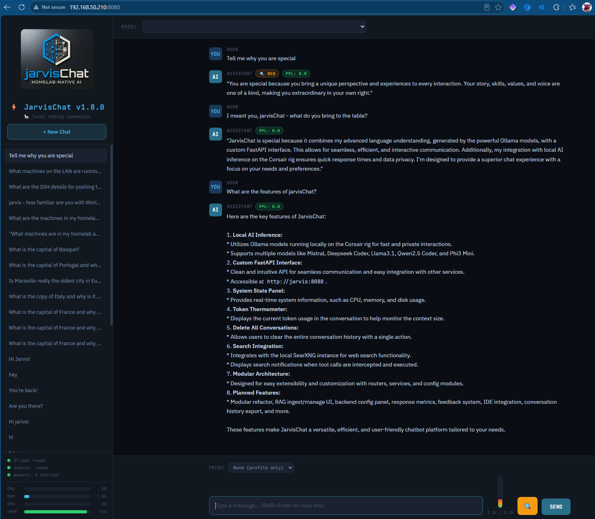

# ⚡ JarvisChat v1.9.0

**A privacy-first, homelab-native developer knowledge platform.**

> JarvisChat turns a heterogeneous LAN of budget hardware into a distributed local AI inference cluster — accumulating institutional knowledge over time, keeping all data off the cloud, and squeezing real performance out of modest consumer hardware through architecture rather than dollars.

This is not another AI chat wrapper. jC is the UX and knowledge-management layer for a local AI brain — analogous to what Windows was to DOS, or what the web is to the internet. The intelligence lives in the model and the RAG corpus. jC makes it accessible and keeps feeding it.

---

## The Four Pillars

### 1. Privacy
Everything runs on your LAN. No API keys, no cloud endpoints, no data leaving your network, no subscription, no terms-of-service surprises. Your conversations, your codebase, your decisions — stay yours.

### 2. Knowledge Retention
Unlike stateless chat tools that forget everything when you close the tab, jC accumulates institutional memory. Every solved problem, every architectural decision, every working command gets absorbed into the RAG corpus via Qdrant. The system gets smarter the longer you use it.

### 3. Budget Hardware Maximization
You don't need a $10,000 workstation. jC is designed for the developer who has a drawer full of machines and the skills to wire them together. RPC clustering, model splitting across CPU and GPU nodes, dynamic resource negotiation, and smart RAG eviction squeeze real performance out of modest consumer hardware.

### 4. Homelab-Native Architecture
Built specifically for the heterogeneous homelab: mixed hardware, mixed OS, consumer GPUs, ARM boards, NAS storage — all working together as a coherent AI platform. A designated master node hosts jC, llama-server, and SearXNG. GPU nodes self-register as RPC inference workers. The architecture scales horizontally across whatever you've got.

---

## Target Audience

Solo developers and homelab enthusiasts who are:
- Budget-constrained but hardware-rich (multiple machines, NAS, spare GPUs)
- Privacy-conscious (no cloud AI subscriptions)
- Technically capable (if you can install jC, you can designate the master node)
- Building something over time and want their AI to remember it

---

## Architecture

```
┌─────────────────────────────────────────────────────────────┐
│                        YOUR LAN                             │
│                                                             │
│  ┌─────────────────┐         ┌──────────────────────────┐  │
│  │   jarvis        │◄──RPC───│   ultron                 │  │
│  │   192.168.50.210│  50052  │   192.168.50.108         │  │
│  │                 │         │                          │  │
│  │  jC :8080       │         │  llama-server :8081      │  │
│  │  SearXNG :8888  │         │  llama-server :8082 (*)  │  │
│  │  RX 6600 XT 8GB │         │  Qdrant :6333            │  │
│  │  GPU RPC worker │         │  mxbai-embed :11434      │  │
│  │  Vulkan backend │         │  AMD Ryzen 7 7840HS      │  │
│  └─────────────────┘         │  Radeon 780M iGPU        │  │
│                              └──────────────────────────┘  │
│                                                             │
│  ┌─────────────────┐         ┌──────────────────────────┐  │
│  │   pivault       │         │   corsair                │  │
│  │   192.168.50.158│         │   192.168.50.132         │  │
│  │                 │         │                          │  │
│  │  10.83TB RAID5  │         │  RTX 5070 Ti 16GB        │  │
│  │  RPi 5 8GB      │         │  Ryzen 7 7800X3D         │  │
│  │  NAS / Kopia    │         │  Gaming / Streaming      │  │
│  └─────────────────┘         └──────────────────────────┘  │
│                                                             │
│  (*) Planned: Qwen2.5-Coder-14B on :8082                   │
└─────────────────────────────────────────────────────────────┘
```

**Data flow:**
```
Browser / IDE (Continue.dev)
    → jC :8080 (FastAPI — auth, RAG, memory, conversation history)
        → Qdrant :6333 (vector search, mxbai-embed-large for embeddings)
        → llama-server :8081 (inference)
            → jarvis RPC :50052 (GPU layer offload — RX 6600 XT)
```

---

## The AMD + NVIDIA Cross-Cluster Reality

This cluster intentionally mixes GPU architectures — **AMD RX 6600 XT on jarvis** and **NVIDIA RTX 5070 Ti on corsair**. This is deliberate and it works.

The RPC layer in llama.cpp is GPU-vendor-agnostic. jarvis runs llama-rpc with a **Vulkan backend** (not ROCm, not CUDA) which provides hardware-neutral GPU acceleration. ultron's llama-server connects to it over TCP and offloads tensor layers without caring what GPU is on the other end.

This means any machine on your LAN with any GPU (AMD, NVIDIA, Intel Arc) can participate as an RPC worker — as long as it can run llama-rpc with Vulkan support.

---

## Cluster Performance Tuning

### The Layer Offloading Trick

The key to squeezing performance out of a CPU+GPU split cluster is `--n-gpu-layers`. This controls how many transformer layers get offloaded to the RPC GPU backend versus staying on the CPU.

**Starting point (before tuning):** ~7 t/s  
**After initial layer optimization:** ~17 t/s  
**After full cluster tuning:** 30–35 t/s

The progression that got us there:

1. **Start with `--n-gpu-layers 99`** — tells llama-server to offload as many layers as possible. With Mistral-Nemo-12B Q4_K_M this results in all 41/41 layers offloading to jarvis GPU via RPC.

2. **Verify GPU is actually working** — watch the llama-server startup log for:
   ```
   load_tensors: offloaded 41/41 layers to GPU
   load_tensors: RPC[192.168.50.210:50052] model buffer size = 6763.30 MiB
   load_tensors: CPU_Mapped model buffer size = 360.00 MiB
   ```
   If layers aren't offloading, the RPC connection isn't established.

3. **Check actual throughput** — the timings block in llama-server responses shows real t/s. Tune from there.

**Current llama-server service on ultron (`/etc/systemd/system/llama-server.service`):**
```ini
[Unit]
Description=Llama.cpp Server (RPC frontend — Mistral-Nemo general)
After=network.target

[Service]
Type=simple
User=root
ExecStart=/root/llama.cpp/build/bin/llama-server \
  --model /home/gramps/models/Mistral-Nemo-Instruct-2407-Q4_K_M.gguf \
  --rpc 192.168.50.210:50052 \
  --host 0.0.0.0 \
  --port 8081 \
  --n-gpu-layers 99
Restart=on-failure
RestartSec=5

[Install]
WantedBy=multi-user.target
```

**llama-rpc service on jarvis (`/etc/systemd/system/llama-rpc.service`):**
```ini
[Unit]
Description=Llama.cpp RPC Server (GPU backend — RX 6600 XT Vulkan)
After=network.target

[Service]
Type=simple
User=root
ExecStart=/root/llama.cpp/build/bin/llama-rpc-server \
  --host 0.0.0.0 \
  --port 50052
Restart=on-failure
RestartSec=5

[Install]
WantedBy=multi-user.target
```

---

## Models

### Current
| Model | Location | Port | Purpose |
|-------|----------|------|---------|
| Mistral-Nemo-Instruct-2407-Q4_K_M | `/home/gramps/models/` on jarvis | ultron:8081 | General assistant, chat |
| mxbai-embed-large | ultron (Docker/Ollama) | ultron:11434 | RAG embeddings |

### Planned
| Model | Size | Port | Purpose |
|-------|------|------|---------|
| Qwen2.5-Coder-14B-Q5_K_M | ~10GB | ultron:8082 | Code completion, pair programming |

> **Note:** ultron has 16GB RAM. Only one primary inference model can be hot at a time. llama-server instances are swapped via systemd when switching between general and code models.

---

## RAG System

jC uses **Qdrant** for vector storage and **mxbai-embed-large** (1024-dim) for embeddings.

### Qdrant Collection
- **Collection:** `jarvis_rag`
- **Vector size:** 1024 (mxbai-embed-large output)
- **Distance:** Cosine
- **Score threshold:** 0.25 (filters low-relevance chunks)
- **Chunks retrieved per query:** 3 (configurable)

### RAM Ceiling
Each vector = 4KB (1024 dims × float32). With ultron's ~4-6GB available to Qdrant after llama-server:
- Practical ceiling: ~1–1.5M chunks before RAM becomes the bottleneck
- Current corpus: 219 points (early stage)
- Storage on disk: negligible against pivault's 10.83TB

### What Gets Ingested
- Code repositories (your actual codebase)
- Pair-programming conversation history
- Architecture decisions and working commands
- Documentation and URLs (fetched and stripped via beautifulsoup4/httpx)

---

## JarvisChat Service (`/etc/systemd/system/jarvischat.service`)

```ini
[Unit]
Description=JarvisChat - Local LLM Developer Platform
After=network.target

[Service]
Type=simple
User=root
WorkingDirectory=/opt/jarvischat
ExecStart=/opt/jarvischat/venv/bin/uvicorn app:app --host 0.0.0.0 --port 8080
Restart=always
RestartSec=5
Environment=PYTHONUNBUFFERED=1
Environment=OLLAMA_BASE=http://192.168.50.108:8081
Environment=LLAMA_SERVER_BASE=http://192.168.50.108:8081

[Install]
WantedBy=multi-user.target
```

---

## Installation

### Prerequisites
- Python 3.11+ (tested on 3.13)
- llama.cpp built from source on both jarvis (RPC server) and ultron (llama-server)
- Qdrant running on ultron
- Ollama on ultron (for mxbai-embed-large embeddings)
- SearXNG on jarvis:8888 (optional, for web search)

### Fresh Install

```bash
sudo mkdir -p /opt/jarvischat
sudo chown $USER:$USER /opt/jarvischat
cd /opt/jarvischat
python3 -m venv venv
./venv/bin/pip install fastapi uvicorn httpx psutil jinja2 python-multipart qdrant-client
mkdir -p templates static
```

Copy `app.py` to `/opt/jarvischat/` and `index.html` to `/opt/jarvischat/templates/`.

### Bootstrap the PIN

```bash
export JARVISCHAT_ADMIN_PIN=XXXX  # your 4-digit PIN
```

Or allow the insecure default for testing:
```bash
export JARVISCHAT_ALLOW_DEFAULT_PIN=true
```

### Environment Variables

| Variable | Default | Description |
|----------|---------|-------------|
| `OLLAMA_BASE` | `http://localhost:11434` | Ollama-compatible endpoint (legacy) |
| `LLAMA_SERVER_BASE` | `http://192.168.50.108:8081` | llama-server OpenAI-compat inference endpoint |
| `JARVISCHAT_ADMIN_PIN` | (none) | 4-digit admin PIN (required on first boot) |
| `JARVISCHAT_ALLOW_DEFAULT_PIN` | `false` | Allow insecure default PIN 1234 |
| `JARVISCHAT_TRUSTED_ORIGINS` | (none) | Comma-separated trusted origins for CSRF |
| `JARVISCHAT_ALLOWED_CIDRS` | RFC1918 + loopback | Allowed client IP CIDRs |

---

## API Endpoints

### Auth
| Method | Path | Description |
|--------|------|-------------|
| POST | `/api/auth/guest` | Create guest session |
| POST | `/api/auth/login` | Admin PIN login |
| POST | `/api/auth/logout` | Revoke session |
| GET | `/api/auth/session` | Check session status |
| POST | `/api/auth/heartbeat` | Keep session alive |

### Chat & Search
| Method | Path | Description |
|--------|------|-------------|
| POST | `/api/chat` | Streaming chat (SSE) |
| POST | `/api/search` | Explicit web search via SearXNG |
| GET | `/api/search/status` | SearXNG health check |

### Models
| Method | Path | Description |
|--------|------|-------------|
| GET | `/api/models` | List available models from llama-server |
| GET | `/api/ps` | Running models |
| POST | `/api/show` | Model info |

### Memory
| Method | Path | Description |
|--------|------|-------------|
| GET | `/api/memories` | List all memories |
| POST | `/api/memories` | Add memory |
| PUT | `/api/memories/{rowid}` | Update memory |
| DELETE | `/api/memories/{rowid}` | Delete memory |
| GET | `/api/memories/search?q=` | FTS5 search memories |
| GET | `/api/memories/stats` | Memory statistics |

### Conversations
| Method | Path | Description |
|--------|------|-------------|
| GET | `/api/conversations` | List conversations |
| POST | `/api/conversations` | Create conversation |
| GET | `/api/conversations/{id}` | Get conversation + messages |
| PUT | `/api/conversations/{id}` | Update title/model |
| DELETE | `/api/conversations/{id}` | Delete conversation |
| DELETE | `/api/conversations` | Delete all conversations |

### Profile & Settings
| Method | Path | Description |
|--------|------|-------------|
| GET | `/api/profile` | Get profile |
| PUT | `/api/profile` | Update profile |
| GET | `/api/settings` | Get settings |
| PUT | `/api/settings` | Update settings |
| GET | `/api/stats` | CPU/RAM/GPU stats |

### Skills
| Method | Path | Description |
|--------|------|-------------|
| GET | `/api/skills` | List all skills |
| GET | `/api/skills/active` | List enabled skills |
| PUT | `/api/skills/{key}` | Enable/disable skill |

---

## Memory Commands

Say these in chat to interact with the memory system:

| Command | Effect |
|---------|--------|
| `remember that [fact]` | Stores fact in FTS5 memory |
| `please remember [fact]` | Same |
| `don't forget [fact]` | Same |
| `forget about [topic]` | Deletes matching memories |

---

## Troubleshooting

### jC starts but inference is slow or failing
Check that llama-rpc is running on jarvis and llama-server is connected:
```bash
# On jarvis
systemctl status llama-rpc

# On ultron — look for "offloaded N/N layers to GPU" in logs
journalctl -u llama-server -n 50 --no-pager
```

### ultron shows no CPU activity during inference
Inference is being handled entirely by jarvis GPU via RPC — this is correct and expected. ultron's CPU is only involved for non-offloaded tensors (a small fraction of the model).

### RAG not returning results
Check Qdrant is up and the collection exists:
```bash
curl http://192.168.50.108:6333/collections/jarvis_rag
```
Verify `points_count` > 0. If zero, the corpus hasn't been seeded yet.

### jC won't start — PIN bootstrap error
Set the PIN via environment before first boot:
```bash
export JARVISCHAT_ADMIN_PIN=XXXX
systemctl restart jarvischat
```

### sqlite3 not found
Use Python instead:
```bash
python3 -c "import sqlite3; print(sqlite3.connect('/opt/jarvischat/jarvischat.db').execute('SELECT * FROM settings').fetchall())"
```

---

## Roadmap

### TODO (Priority Order)
1. **Tool calling** — read_file/write_file with /opt/jarvischat whitelist, tool_calls dispatch loop
2. **git_tool** — Gitea integration for commit/push from jC
3. **Audit logging** — structured audit trail to syslog
4. SearXNG persistence (DONE ✅)
5. search+ prefix for explicit search
6. profile.example.md
7. Conversation search/filter
8. Export to markdown
9. Keyboard shortcuts
10. Retry button
11. Source links in responses
12. Rename conversations
13. Multiple profiles
14. KWIC auto-tags
15. Image input (vision)
16. btop split-screen integration
17. Containerize
18. SearXNG health indicator in UI
19. check_patch_notes tool
20. GitLab mirror of llgit repo

### ROADMAP (Longer Horizon)

**(A) Modular refactor** — Split monolithic app.py into routers/, services/, config.py, db.py, auth.py. Prerequisite for everything below.

**(B) RAG ingest/manage UI** — File upload, URL ingest (fetch + strip HTML via beautifulsoup4/httpx, store URL as source metadata for citation), delete chunks/collections.

**(C) Backend config panel** — Switch between Ollama/llama-server, endpoint URLs, model switching, restart — all from the UI without touching config files.

**(D) Response metrics display** — tokens/sec, TTFT, context size, RAG chunks retrieved + scores — visible in the UI per response.

**(E) Response quality feedback** — thumbs/stars/tags per response → feedback corpus → future RLHF dataset.

**(F) IDE integration** — Continue.dev + VS Code, pointed at jC:8080 (not direct to inference endpoint). All IDE traffic — including pair-programming conversations — goes through jC so sessions are persisted and become RAG-worthy content. jC needs FIM request format handling to support inline autocomplete.

**(G) Conversation history export → RAG ingest** — Bulk ingest existing conversation history into Qdrant.

**(H) Fine-tuning pipeline** — LoRA on Mistral-Nemo from feedback corpus (item E).

**(I) Autonomous RAG** — At conversation end, jC self-evaluates the transcript, extracts significant chunks (solved problems, working commands, architectural decisions), and ingests them into Qdrant automatically with metadata (date, conversation_id, reason). jC decides what it needs to remember. Closes the loop.

**(J) Startup hardware/resource self-assessment** — On boot, jC queries ultron for available RAM, Qdrant consumption, and llama-server footprint. Derives dynamic high-water marks for RAG chunk limits, context window sizing, retrieval limits, and eviction thresholds. Writes a living config file. Replaces magic numbers with runtime-negotiated values.

**(K) RAG corpus management** — Weighted LRU eviction with composite score (recency + frequency + content age) + manual pin flag for load-bearing knowledge. Prevents corpus bloat from degrading retrieval quality. Analogous to memcache eviction policy.

**(L) Dual inference model architecture** — Mistral-Nemo-12B on ultron:8081 (general assistant), Qwen2.5-Coder-14B-Q5_K_M on ultron:8082 (code/pair programming). jC selects endpoint based on active model. Only one model hot at a time given ultron's 16GB RAM constraint.

**(M) MCP server compatibility** — Expose jC as an MCP server. Minimum scope: tool manifest endpoint, SSE transport, chat and RAG query as callable tools. Depends on TODO #22 (OpenAI-compat `/v1/chat/completions` endpoint). Reference: [bubblit](https://github.com/soup-oss/bubblit) for behavior-class lazy loading of tool manifests.

**(N) AMQP Cluster Nervous System** — RabbitMQ on ultron as the cluster master/hub. Topic exchange `jc.cluster`, direct exchange `jc.commands`. Worker nodes (jarvis + future nodes) self-register by connecting to the ultron broker and publishing to `node.<hostname>.health` (GPU/RPC/RAM stats) and `node.<hostname>.models` (available GGUFs). jC subscribes to all `node.*` topics — drives UI status dots, model dropdown, and resource bars. Commands flow ultron→node via `cmd.<hostname>.*` queues (e.g. model load, service restart). **Long-term vision:** a resident AI model on each node acts as the AMQP agent — consuming its command queue, building a prompt, deciding action, publishing result. The message bus becomes the nervous system for a distributed agentic cluster where intelligence lives at the edges. ultron orchestrates; worker nodes are autonomous agents. Scales to arbitrary additional nodes with no topology changes.


---

## Primary Cluster Objectives

1. **Generative AI inference** — Local, private, fast enough to be useful
2. **Agentic functionality** — Autonomous RAG self-management is the canonical first example. The system acts, not just responds.

---

## Repository

```
ssh://gitea@llgit.llamachile.tube:1319/gramps/jarvisChat.git
```

> SSH username is `gitea`, not `git`. Port 1319.

---

## License

MIT
