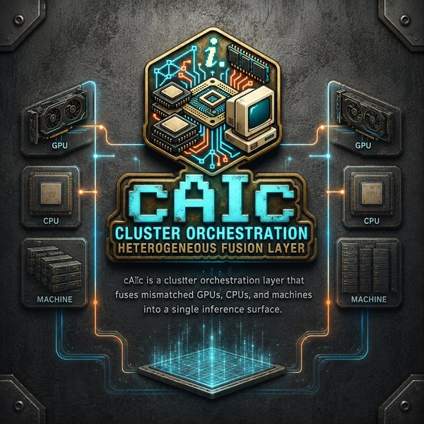

# cAIc v0.20.0

Consumer AI hardware is a wasteland of incompatibility. NVIDIA speaks CUDA, AMD speaks ROCm. Your RTX 5070 Ti lives in one machine with 16 GB VRAM; your RX 6600 XT lives in another with 12 GB. Alone, neither can run a 14B model at usable speed. Together, they could — if the software stack didn't treat heterogeneous hardware as a bug instead of a feature.

The industry consensus — llama.cpp RPC, vLLM, TensorFlow distributed — all assume a homogeneous cluster: same GPU vendor, same VRAM, same driver stack, reachable over a fast fabric. This assumption works for data centers that buy 64 identical H100s at a time. It does not work for the person who has a gaming PC with an NVIDIA card in the living room, an AMD-powered home server in the closet, and an old MacBook on the desk. That person has more aggregate compute than any single consumer machine, but no software stack can make it cooperate.

cAIc is a cluster orchestration layer that fuses mismatched GPUs, CPUs, and machines into a single inference surface. The advantage isn't just compatibility — it's matching each request to the hardware best suited for it. The coordinator (CPU-only, no discrete GPU) handles all CPU-bound work: RAG embedding, query triage, web search, memory, conversation storage, the message broker, and the web UI itself. Workers (discrete GPU) do nothing but inference — no database, no browser sessions, no orchestration overhead stealing VRAM. Triage classifies each query and routes to the node running the optimal model; if the right model isn't loaded, the coordinator requests a swap and the worker handles it asynchronously. Every machine contributes what it does best.

You might also be doing this with retired office PCs and GPUs from the Obama era. That works too. But the core problem cAIc solves isn't budget reuse — it's making non-homogeneous hardware cooperate.

### Paired Programming

Every line of code in this repository was written by an AI (Claude, via opencode). But AI does not architect, design, test, deploy, or decide what to build — that requires experience, judgement, and the discipline to say "no" to feature creep.

**Gramps** (BS Computer Science, Oklahoma State, coding since 1981) performed that role — designing the architecture, managing the development process, writing and maintaining the test suite, operating the deployment pipeline, and directing every feature decision across dozens of sessions spanning months. Without that human steering, this would be yet another AI-generated repo that compiles but doesn't solve a real problem. With it, cAIc ships as a functional, tested, deployed system that runs 24/7 on real hardware serving real users.

This is paired programming, elevated: the AI handles the mechanical work of code generation; the human brings decades of systems-level experience, architectural judgment, and the maturity to ship something that lasts.

### Architecture: CPU Coordinator + GPU Workers

cAIc splits the workload across two machine roles:

**Coordinator** (ultron — Ryzen 7 7840HS, no discrete GPU) runs the FastAPI app, RAG vector search (Qdrant), text embedding (Ollama on CPU), query triage (Phi-4-mini), web search (SearXNG), message broker (RabbitMQ), and all SQLite-backed services — memory, profiles, conversations, settings. Every CPU-bound task stays here.

**Workers** (jarvis — RX 6600 XT 12 GB / corsair — RTX 5070 Ti 16 GB) run only llama-server for GPU inference. The coordinator never touches a model; workers never touch the database. Workers register via AMQP, receive ping/pong health checks, and accept model-swap commands when triage determines a different model is needed for the current query.

This split keeps the UI responsive during inference (the coordinator isn't blocked by GPU compute) and lets workers focus VRAM entirely on model weights rather than browser sessions or API orchestration.

### Single-Node Deployment (Experimental)

cAIc can also run entirely on one machine with all services colocated — coordinator, llama-server, Qdrant, SearXNG, and RabbitMQ all on localhost. This is useful for testing, laptops, or WSL2 under Windows 11.

To deploy single-node, override the remote service URLs:

```bash
export CAIC_QDRANT_URL=http://localhost:6333
export CAIC_EMBED_URL=http://localhost:11434
export LLAMA_SERVER_BASE=http://localhost:8081
# AMQP URL is already configurable via CAIC_AMQP_URL
```

All services degrade gracefully if unreachable — RAG, search, cluster, and triage log warnings and continue. Only llama-server (inference) is strictly required.

Untested: Windows 11 / WSL2 (Debian). The codebase is pure Python with no platform-specific dependencies beyond `rocm-smi` (AMD GPU stats, gracefully absent) and `system_profiler` (macOS, absent on Linux/WSL). llama.cpp builds and runs on WSL2 with NVIDIA GPU passthrough.

Under the hood: FastAPI + SQLite + Jinja2 on Python 3.13. AMQP-mediated cluster coordination with an OpenAI-compatible inference endpoint.

#### Query-routing vs. layer-splitting — why it matters

Most distributed inference tools (llama.cpp RPC, vLLM with tensor parallelism, exo) split a *single model* across multiple GPUs. The first GPU runs layers 0–15, the second runs 16–31, and so on. This works well in a homogeneous cluster where every GPU is identical, but in a heterogeneous setup the slowest card sets the pace — every forward pass waits for the straggler. Communication overhead between GPUs (NCCL, RPC) adds latency too.

cAIc takes a different approach: **query-routing**. Each worker runs a complete model on its own GPU. When a query comes in, triage classifies it and routes the *whole request* to the worker best suited for it — code questions go to the worker with a coder model, general chat goes to the instruct model. No layer sharing, no lockstep, no straggler problem. The tradeoff is that no single query can use combined VRAM across multiple GPUs, but the throughput and responsiveness of the cluster as a whole isn't dragged down by the weakest link.

This also means a worker with a slow GPU can still contribute meaningfully — it handles less latency-sensitive queries or batch background work, while the fast GPU handles interactive chat.

### Data Safety

| Concern | How cAIc handles it |
|---------|---------------------|
| **Queries stored on disk?** | All query-derived text is encrypted at rest with AES-256-GCM before touching SQLite or Qdrant. Toggle **Private Chat** (topbar badge) and nothing touches disk at all: no SQLite writes, no FTS5 memory injection, no RAG ingestion, no external SearXNG queries. |
| **Queries sent to external services?** | SearXNG web search is optional and disabled in Private Chat. All other services (llama-server, Qdrant, RabbitMQ) run on your own LAN. |
| **Inter-node traffic unencrypted?** | No — WireGuard tunnels encrypt all coordinator↔worker traffic (AMQP, inference, RPC) at the network layer. Zero application changes. |
| **Who can access the server?** | Guest sessions for anyone on the LAN. Admin access protected by a PBKDF2-hashed 4-digit PIN with rate-limited attempts. IP allowlist (CIDR) gate optional. |

At v1.0, this ships with a Docker compose stack and setup wizard that detect CPU vs GPU, probe your hardware, and stand up SearXNG, Qdrant, RabbitMQ, and everything else with a single `docker compose up`. The same install docs work bare-metal for those who prefer to skip containers entirely.

Developer wiki: [Home](https://llgit.llamachile.tube/gramps/cAIc/wiki/Home) — includes [FAQ](https://llgit.llamachile.tube/gramps/cAIc/wiki/FAQ), [Installation Guide](https://llgit.llamachile.tube/gramps/cAIc/wiki/Installation), and [full architecture docs](https://llgit.llamachile.tube/gramps/cAIc/wiki/Developer-Architecture)

## What's New in v0.20.0

### At-Rest Encryption (Full Data Privacy)

All user query-derived text is now encrypted with AES-256-GCM before being written to disk. Every storage path is covered:

- **Conversations** — message content and titles encrypted in SQLite
- **Memories** — FTS5 facts encrypted; search performs Python-side matching on decrypted text
- **Upload context** — document text encrypted in SQLite
- **RAG corpus** — chunk text encrypted in Qdrant payloads
- **Completions (IDE integration)** — messages and titles encrypted

**Key management**: 256-bit key auto-generated on first boot, stored in the `settings` table as a non-obvious key name (`heartbeat_interval_ms`). Never exposed via any API endpoint. If the key is deleted, stored data is unrecoverable.

**Zero-trust boundary**: the encryption key lives in the same SQLite database as the encrypted data. This protects against filesystem-level access (stolen `.db` file, backup exposure, disk forensic recovery) but does not protect against runtime compromise (attacker with SQLite read access while the server is running, since decryption keys are in memory during requests).

## What's New in v0.19.3

### Private Chat Mode (B8)
- **PRIVATE badge** — topbar toggle switches to private mode where nothing is persisted, no memory/RAG is injected, and web search is disabled
- **Info popup** — click the (i) icon next to the badge for a full explanation of what private mode does and doesn't do
- **No-storage guarantee** — conversation is streamed to the user but never touches SQLite, FTS5, or Qdrant
- **Search blocked** — `/api/search` returns 403 in private mode; WEB button is disabled in the UI

### WireGuard In-Transit Encryption
- WireGuard tunnels encrypt all inter-node traffic. See Data Safety section above.

## What's New in v0.19.2

### Waterfall Direction Toggle (B6) + UX Polish
- **NEW/OLD toggle** — topbar button switches between newest-first (waterfall) and oldest-first (traditional chat)
- **Direction-aware scroll** — newest-first scrolls to top, oldest-first scrolls to bottom; respects user scroll-away to avoid fighting
- **localStorage persistence** — preference survives page reloads, default is newest-first (waterfall)
- **Toast notifications** — slide-out notifications for copy, save, delete, rate actions
- **Clipboard reliability** — `execCopy()` helper for HTTP fallback (`document.execCommand`) when `navigator.clipboard` fails on plain HTTP
- **Model label** — `modelLabel()` derives shorthand display names (e.g. `qwen2.5:7B:i`)
- **Keybinding fix** — Shift+Enter = newline, Ctrl+Enter = send (universal conventions)
- **Token counter** — resets to 0 on page refresh, no longer persisted to localStorage

## What's New in v0.19.1

### Default Model Auto-Pull on First Start (B5)
- **`model_pull.py`** — new module that checks if `default_model` is available on llama-server at startup, falls back to Ollama pull API if not found
- **Startup integration** — `app.py` lifespan calls `ensure_model()` after `assess_hardware()`, pulling the missing model via Ollama's streaming pull API
- **Idempotent** — skips pull if model already available on llama-server or Ollama

## What's New in v0.19.0

### Apple Silicon Worker Support (B7)
- **`gpu.py`** — now detects `sys.platform == "darwin"` and parses `system_profiler SPDisplaysDataType` for GPU model/VRAM instead of `rocm-smi`
- **`hardware.py`** — darwin branch via `_get_vram_darwin()` for VRAM assessment on macOS
- **`node_agent/agent.py`** — `get_load()` reports VRAM via `system_profiler SPDisplaysDataType` on macOS workers
- Hybrid detection — falls back to AMD rocm-smi on Linux, `available: False` if neither is detected

## What's New in v0.18.0

### Wiki — Installation Guide, Screenshots Gallery, Full Documentation
- **New Installation & Configuration page** — bare-metal walkthrough, cluster setup, config reference, security checklist, 12 troubleshooting topics. Everything a new user needs to get cAIc running.
- **Screenshots gallery** — clickable image gallery on the wiki Screenshots page
- **Wiki fully populated** — 5 pages linked from Home, renders at root URL

### UX Polish — Waterfall Layout, Barcode Stripes, Confidence Badges
- **Waterfall display** — newest messages at top via `prepend()`, scroll to top
- **Barcode alternating pairs** — each Q&A wrapped in `.msg-pair` with alternating tint + left border accent
- **Confidence % badge** (`1/ppl * 100`) replaces raw perplexity, color-coded green/orange/red
- **Cumulative token counter (TOK)** in topbar center, persisted in `localStorage`
- **TOK reformatted** to `# / %` — `#` is all-time tokens, `%` is last response's context-window percentage, color-coded
- **Dot-matrix sprocket strips** on left/right edges of `.main` (24px strips, punch-hole pattern)
- **Paper grain background** on chat container
- **Timestamps on user messages** (`HH:MM`), later upgraded to `MON dd, YYYY HH:MM:SS.ss` centisecond precision
- **Shift+Enter** triggers web search
- **Typing indicator greys out** on abort
- **Token count badge** on search responses using client-side `tokenCount`
- **Removed status dots** from input area (no functional purpose)
- **Removed thumbs** from toolbar, restored only on non-search AI responses

### Version bumped to v0.18.0

## What's New in v0.17.26

### Dynamic Model Swap — `request_model_swap()`, `select_node()` async (Roadmap N Task 14)
- **`cluster.py`** — `request_model_swap()` publishes `cmd.swap_model` to `jc.admin`; `handle_model_ready()` and `handle_model_failed()` consume `model_ready`/`model_failed` on `jc.system`
- **`select_node()` async** — Queries worker `inventory` for ideal model; triggers swap if model not active, returns `None` for fallback during swap
- **`SUBSCRIBE_TABLE`** — 7 AMQP routing key bindings in cluster.py

### Cluster Status UI — Heartbeat + Live Status Panel (Roadmap N Task 15)
- **`handle_heartbeat()`** — Consumes `node.*.heartbeat` on `jc.system` to update `last_seen` per node
- **UI cluster panel** — sidebar polls `GET /api/cluster` every 15s; green=active, yellow=swapping, red=error/offline
- **Version bumped to v0.17.0** — All 179 tests pass

### What's New in v0.14.0

### Cluster Protocol — `GET /api/cluster`, 9 AMQP Message Types (Roadmap N Task 11)
- **`cluster.py`** — Node registry (`CLUSTER_NODES`), bounded event log (`CLUSTER_EVENTS`, max 1000), coordinator auto-promotion
- **Ping/pong health** — No passive heartbeats; coordinator pings workers on-demand before routing work. 5s timeout → auto-deregister
- **9 message types** — register, deregister, admitted, rejected, ping, pong (on `jc.admin`); event, coord_query, coord_response (on `jc.system`)
- **`amqp.py` subscribe()** — Exclusive anonymous queues bound to routing keys; `_rebind_subscriptions()` recreates them on reconnect
- **`routers/cluster.py`** — `GET /api/cluster` returns nodes, coordinator, event log

### RAG Corpus Management — `POST /api/rag/flush`, `GET /api/rag/stats` (v0.13.0)
- **Score-based eviction** with hysteresis (80% high-water, 20% low-water) and pinned sources
- **Eviction engine** in `eviction.py` — scroll Qdrant, score by retrieval count + age, evict lowest scores first
- **Grace period** — vectors younger than 1 hour are never evicted
- **Flush endpoint** — `POST /api/rag/flush` (admin) deletes all non-pinned vectors
- **Stats endpoint** — `GET /api/rag/stats` (admin) returns vector count, at-risk count, pinned count, eviction rates

### File & Document Attachments (v1.9.0–v1.10.0)
- **`POST /api/upload`** — multipart file upload with PDF/text extraction; modes: `context` (chat injection), `ingest` (RAG corpus), `both`
- **`DELETE /api/upload/{id}`** — removes upload from SQLite + Qdrant
- **`PATCH /api/upload/{id}/link`** — associates upload with a conversation
- **`GET /api/upload/by-conversation/{id}`** — list attachments per conversation
- **Paperclip UI** — file picker, preview pill, image thumbnails, gallery overlay
- **Attachment indicators** — 📎 badge on conversations with attachments
- **Chat context injection** — `upload_context_id` prepends document text to system prompt

### Terminal RAG Hook — `POST /api/ingest` (v0.11.0)
- Bearer token auth (same key as `/v1/chat/completions`)
- Chunking via shared `chunk_text()` helper, embed via Ollama, upsert to Qdrant
- `caic-ingest.sh` — PROMPT_COMMAND shell script for autonomous terminal history ingestion

### v1.8.0 Foundation (refactor & fixes)
- **Modular refactor** — single-file `app.py` split into `config.py`, `db.py`, `auth.py`, `security.py`, `memory.py`, `search.py`, `rag.py`, `gpu.py`, and `routers/` package
- **Perplexity auto-search fixed** — `logprobs: true` now properly extracted from stream chunks
- **All `/api/models` endpoints** target `LLAMA_SERVER_BASE` (llama-server) not Ollama
- **RAG embedding** via Ollama at `http://192.168.50.210:11434`
- **Origin check** applies to all API methods, rejects absent Origin/Referer

## Features

- **Persistent Memory** — SQLite FTS5 full-text search for fast, relevant memory retrieval
- **Web Search** — SearXNG integration for automatic web lookups when the model is uncertain
- **Explicit Search** — Search button to force web search without waiting for model uncertainty
- **Profile Injection** — Custom system prompt injected into every conversation
- **System Presets** — Save and switch between different system prompts
- **Real-time Stats** — CPU, RAM, GPU, VRAM monitoring in sidebar
- **Token Thermometer** — Visual context window usage indicator
- **Streaming Responses** — Server-sent events for real-time token display
- **Conversation History** — SQLite-backed chat persistence with mass-delete option
- **Model Switching** — Change inference models on the fly
- **Skills Framework** — Built-in skill registry with per-skill enable/disable controls
- **Private Chat** — Toggle to keep conversations ephemeral: no persistence, no memory/RAG, no web search
- **At-Rest Encryption** — AES-256-GCM encryption of all query-derived text on disk (SQLite + Qdrant)

## File Structure

```
/opt/caic/
├── amqp.py             # aio-pika AMQP connection manager + subscribe/rebind
├── app.py              # FastAPI app entry point
├── auth.py             # PIN-based guest/admin sessions, auth routes
├── cluster.py          # Cluster protocol: node registry, event log, ping/pong
├── config.py           # Constants, env vars, limits, skill registry
├── crypto.py           # AES-256-GCM encrypt/decrypt + key management
├── db.py               # SQLite schema, connection factory
├── eviction.py         # Score-based RAG eviction engine
├── gpu.py              # GPU stats — rocm-smi (Linux/AMD) + system_profiler (Darwin/Apple Silicon)
├── hardware.py         # Hardware self-assessment (CPU, RAM, VRAM) — Linux + Darwin
├── memory.py           # FTS5 memory CRUD, remember/forget commands
├── rag.py              # Qdrant vector search + system prompt assembly
├── search.py           # SearXNG integration, perplexity, refusal detection
├── security.py         # Rate limiting, origin checks, IP allowlist, audit
├── model_pull.py         # Startup model auto-pull (llama-server → Ollama fallback)
├── triage.py           # Query classification + cluster node selection
├── routers/
│   ├── chat.py         # /api/chat streaming endpoint
│   ├── cluster.py      # Cluster status endpoint
│   ├── completions.py  # /v1/chat/completions OpenAI-compat endpoint
│   ├── conversations.py# Conversation CRUD
│   ├── ingest.py       # Terminal RAG ingest
│   ├── memories.py     # Memory CRUD API
│   ├── models.py       # Model listing, system stats
│   ├── presets.py      # System prompt presets
│   ├── profile.py      # User profile
│   ├── search_route.py # /api/search explicit search endpoint
│   ├── settings.py     # Runtime settings
│   ├── skills.py       # Skills management
│   └── upload.py       # File attachment endpoints
├── static/
│   └── logo.png        # Logo image (optional)
├── templates/
│   └── index.html      # Frontend
├── node_agent/
│   ├── agent.py        # Standalone worker agent (AMQP client)
│   └── requirements.txt
└── tests/              # 200 pytest tests
```

## Requirements

- Python 3.11+ (tested on 3.13)
- llama-server running locally or on network (OpenAI-compatible API on port 8081)
- SearXNG (optional, for web search)
- RabbitMQ (optional, for AMQP cluster — coordinator only)
- Qdrant (optional, for RAG vector search)
- WireGuard (optional, for encrypted inter-node transit — see [WireGuard-Setup.md](docs/wiki/WireGuard-Setup.md))

## Installation

### Fresh Install

```bash
# Create directory and venv
sudo mkdir -p /opt/caic
sudo chown $USER:$USER /opt/caic
cd /opt/caic
python3 -m venv venv

# Install dependencies
pip install fastapi uvicorn httpx psutil jinja2 python-multipart pypdf aio-pika

# Set admin PIN before first startup (4 digits)
export CAIC_ADMIN_PIN=4827

# Create subdirectories
mkdir -p templates static

# Copy files
# (copy all .py files to /opt/caic/)
# (copy routers/ directory to /opt/caic/)
# (copy templates/index.html to /opt/caic/templates/)
```

WARNING: Do not use `1234` as your admin PIN unless you accept weak local security.

NOTE: First boot requires `CAIC_ADMIN_PIN` unless you explicitly opt into insecure fallback with `CAIC_ALLOW_DEFAULT_PIN=true`.

## Systemd Service

Create `/etc/systemd/system/caic.service`:

```ini
[Unit]
Description=cAIc - Local Inference Web Interface
After=network.target

[Service]
Type=simple
User=caic
Group=caic
WorkingDirectory=/opt/caic
ExecStart=/opt/caic/venv/bin/uvicorn app:app --host 0.0.0.0 --port 8080
Restart=always
RestartSec=5

[Install]
WantedBy=multi-user.target
```

```bash
sudo systemctl daemon-reload
sudo systemctl enable caic
sudo systemctl start caic
```

## Memory Commands

In chat, natural language triggers memory operations:

| You say | What happens |
|---------|--------------|
| "remember that I prefer Rust over Go" | Stores as `preference` |
| "remember that cAIc runs on port 8080" | Stores as `infrastructure` |
| "note that the deadline is Friday" | Stores as `general` |
| "forget about the deadline" | Removes matching memories |

Memories are automatically searched based on your message content and injected into the system prompt when relevant.

### Memory Topics

Memories are auto-categorized:
- `preference` — likes, dislikes, choices
- `project` — active work, repos, tasks
- `infrastructure` — servers, services, configs
- `personal` — name, location, background
- `general` — everything else

## API Endpoints

### Completions (OpenAI-compatible)

| Method | Endpoint | Description |
|--------|----------|-------------|
| POST | `/v1/chat/completions` | OpenAI-compatible chat (requires Bearer API key) |

### Chat & Search

| Method | Endpoint | Description |
|--------|----------|-------------|
| POST | `/api/chat` | Send message (streaming SSE) |
| POST | `/api/search` | Explicit web search (streaming SSE) |

### File Upload & Ingest

| Method | Endpoint | Description |
|--------|----------|-------------|
| POST | `/api/upload` | Upload file (multipart, admin) |
| DELETE | `/api/upload/{id}` | Delete upload (admin) |
| PATCH | `/api/upload/{id}/link` | Link upload to conversation (admin) |
| GET | `/api/upload/by-conversation/{id}` | List uploads for conversation |
| POST | `/api/ingest` | Ingest text into RAG (Bearer token auth) |

### Memory

| Method | Endpoint | Description |
|--------|----------|-------------|
| GET | `/api/memories` | List all memories |
| POST | `/api/memories` | Add memory |
| PUT | `/api/memories/{rowid}` | Update memory |
| DELETE | `/api/memories/{rowid}` | Delete memory |
| GET | `/api/memories/search?q=term` | Search memories |
| GET | `/api/memories/stats` | Get counts by topic |

### Cluster

| Method | Endpoint | Description |
|--------|----------|-------------|
| GET | `/api/cluster` | Cluster status (nodes, coordinator, event log) |

### RAG Management

| Method | Endpoint | Description |
|--------|----------|-------------|
| GET | `/api/rag/stats` | RAG corpus stats (admin) |
| POST | `/api/rag/flush` | Delete non-pinned vectors (admin) |

### Models & System

| Method | Endpoint | Description |
|--------|----------|-------------|
| GET | `/api/models` | List available models |
| GET | `/api/ps` | List loaded models |
| POST | `/api/show` | Get model info |
| GET | `/api/stats` | CPU, RAM, GPU, VRAM stats |
| GET | `/api/search/status` | SearXNG availability |

### Settings & Profile

| Method | Endpoint | Description |
|--------|----------|-------------|
| GET | `/api/profile` | Get profile content |
| PUT | `/api/profile` | Update profile (admin) |
| GET | `/api/profile/default` | Get default profile |
| GET | `/api/settings` | Get settings |
| PUT | `/api/settings` | Update settings (admin) |

### Conversations

| Method | Endpoint | Description |
|--------|----------|-------------|
| GET | `/api/conversations` | List conversations |
| POST | `/api/conversations` | Create conversation |
| GET | `/api/conversations/{id}` | Get conversation with messages |
| PUT | `/api/conversations/{id}` | Update conversation title/model |
| DELETE | `/api/conversations/{id}` | Delete conversation |
| DELETE | `/api/conversations` | Delete ALL conversations |

### Presets

| Method | Endpoint | Description |
|--------|----------|-------------|
| GET | `/api/presets` | List presets |
| POST | `/api/presets` | Create preset |
| PUT | `/api/presets/{id}` | Update preset |
| DELETE | `/api/presets/{id}` | Delete preset |

### Skills

| Method | Endpoint | Description |
|--------|----------|-------------|
| GET | `/api/skills` | List all skills with state |
| GET | `/api/skills/active` | List active skills |
| PUT | `/api/skills/{key}` | Toggle skill enabled (admin) |

### Auth

| Method | Endpoint | Description |
|--------|----------|-------------|
| POST | `/api/auth/guest` | Create guest session |
| POST | `/api/auth/login` | Admin PIN login |
| POST | `/api/auth/logout` | Revoke session |
| GET | `/api/auth/session` | Check session validity |
| POST | `/api/auth/heartbeat` | Extend session TTL |

## Configuration

Settings are stored in the `settings` table and include:

- `profile_enabled` — Inject profile into chats (true/false)
- `search_enabled` — Auto web search (true/false)
- `memory_enabled` — Memory injection (true/false)
- `skills_enabled` — Skills framework (true/false)
- `default_model` — Default inference model

## Testing

```bash
python3 -m pytest tests/ -v
```

All 200 tests use `tmp_path` fixtures + monkeypatched `httpx.AsyncClient`/`aio-pika`. No external services needed.

## License

MIT

## Repository

Gitea: `ssh://gitea@llgit.llamachile.tube:1319/gramps/caic.git`
