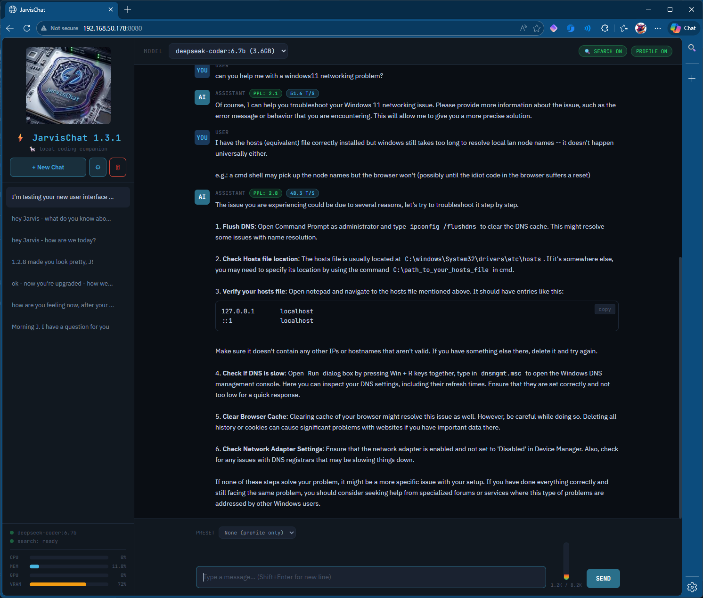

# ⚡ JarvisChat v1.5.0



**A lightweight Ollama coding companion with persistent memory, web search, and real-time system monitoring.**

Built with FastAPI + SQLite + Jinja2. Runs on Python 3.13. No Docker required.

## What's New in v1.5.0

- **Explicit Web Search Button** — 🔍 button next to SEND forces a web search, bypassing model uncertainty detection
- **Orange Search Styling** — Search results, WEB badge, and search button share consistent orange color scheme
- **Expanded Refusal Patterns** — Added "As an AI model", "based on my training data", "I don't have the capability"
- **Code cleanup** — Removed unused `JSONResponse` import and dead `raw_results_md` variable
- **Bug fixes** — Replaced bare `except` clauses with `except Exception`; corrected `add_memory()` return type to `int | None`; updated `TemplateResponse` call to Starlette's current API signature

## What's New in v1.4.0

- **FTS5 Memory System**: Say "remember that..." to store facts — they're automatically retrieved by relevance and injected into context
- **Forget Command**: Say "forget about..." to remove memories
- **Memory Toggle**: Enable/disable memory injection from topbar or settings
- **Multi-file Structure**: Backend and frontend separated for easier maintenance

## Features

- **Persistent Memory** — SQLite FTS5 full-text search for fast, relevant memory retrieval
- **Web Search** — SearXNG integration for automatic web lookups when the model is uncertain
- **Explicit Search** — 🔍 button to force web search without waiting for model uncertainty
- **Profile Injection** — Custom system prompt injected into every conversation
- **System Presets** — Save and switch between different system prompts
- **Real-time Stats** — CPU, RAM, GPU, VRAM monitoring in sidebar
- **Token Thermometer** — Visual context window usage indicator
- **Streaming Responses** — Server-sent events for real-time token display
- **Conversation History** — SQLite-backed chat persistence with mass-delete option
- **Model Switching** — Change Ollama models on the fly

## TODO

1. ~~Verify SearXNG and Docker services persist across reboots~~
2. Conversation search/filter by keyword
3. Export conversation to markdown/text
4. Keyboard shortcuts (Ctrl+N new chat, Ctrl+Enter send)
5. Retry button on assistant messages
6. Source links — clickable links when search used
7. Allow conversation renaming
8. Multiple profiles — coding/sysadmin/general
9. Auto-generate conversation tags (client-side KWIC, top 5, filterable badges)
10. Image input support — pull vision model, file input/drag-drop, base64 encode, pass `images` array to Ollama `/api/chat`
11. Split-screen option for btop display
12. Skills as markdown files — `/opt/jarvischat/skills/`, YAML frontmatter + instructions, injected into context for tool calls
13. Heartbeats / proactive check-ins — cron + endpoint for daily briefings, HA anomaly alerts
14. Model info button — (i) icon next to Model dropdown, shows div with model description, last updated date, best-use purpose
15. Set default model — toggle any model as the default selection
16. Hide/remove model from list — exclude models from dropdown
17. Update model function — trigger `ollama pull` for selected model from UI
18. Add mouseover tooltip to SEND button

## File Structure

```
/opt/jarvischat/
├── app.py              # FastAPI backend
├── jarvischat.db       # SQLite database (auto-created)
├── static/
│   └── logo.png        # Logo image (optional)
└── templates/
    └── index.html      # Frontend
```

## Requirements

- Python 3.11+ (tested on 3.13)
- Ollama running locally or on network
- SearXNG (optional, for web search)

## Installation

### Fresh Install

```bash
# Create directory and venv
sudo mkdir -p /opt/jarvischat
sudo chown $USER:$USER /opt/jarvischat
cd /opt/jarvischat
python3 -m venv venv

# Install dependencies
./venv/bin/pip install fastapi uvicorn httpx psutil jinja2 python-multipart

# Create subdirectories
mkdir -p templates static

# Copy files
# (copy app.py to /opt/jarvischat/)
# (copy index.html to /opt/jarvischat/templates/)
# (copy logo.png to /opt/jarvischat/static/ — optional)
```

### Upgrading from v1.4.x

```bash
cd /opt/jarvischat

# Backup
cp app.py app.py.bak
cp templates/index.html templates/index.html.bak

# Copy new files
# (copy app.py, replacing old version)
# (copy index.html to templates/)

# Restart
sudo systemctl restart jarvischat
```

## Systemd Service

Create `/etc/systemd/system/jarvischat.service`:

```ini
[Unit]
Description=JarvisChat - Local Ollama Web Interface
After=network.target

[Service]
Type=simple
User=jarvischat
Group=jarvischat
WorkingDirectory=/opt/jarvischat
ExecStart=/opt/jarvischat/venv/bin/uvicorn app:app --host 0.0.0.0 --port 8080
Restart=always
RestartSec=5

[Install]
WantedBy=multi-user.target
```

```bash
sudo systemctl daemon-reload
sudo systemctl enable jarvischat
sudo systemctl start jarvischat
```

## Memory Commands

In chat, natural language triggers memory operations:

| You say | What happens |
|---------|--------------|
| "remember that I prefer Rust over Go" | Stores as `preference` |
| "remember that JarvisChat runs on port 8080" | Stores as `infrastructure` |
| "note that the deadline is Friday" | Stores as `general` |
| "forget about the deadline" | Removes matching memories |

Memories are automatically searched based on your message content and injected into the system prompt when relevant.

### Memory Topics

Memories are auto-categorized:
- `preference` — likes, dislikes, choices
- `project` — active work, repos, tasks
- `infrastructure` — servers, services, configs
- `personal` — name, location, background
- `general` — everything else

## API Endpoints

### Memory

| Method | Endpoint | Description |
|--------|----------|-------------|
| GET | `/api/memories` | List all memories |
| POST | `/api/memories` | Add memory `{"fact": "...", "topic": "general"}` |
| DELETE | `/api/memories/{rowid}` | Delete memory by ID |
| GET | `/api/memories/search?q=term` | Search memories |
| GET | `/api/memories/stats` | Get counts by topic |

### Chat & Models

| Method | Endpoint | Description |
|--------|----------|-------------|
| GET | `/api/models` | List available Ollama models |
| POST | `/api/chat` | Send message (streaming SSE) |
| POST | `/api/search` | Explicit web search (streaming SSE) |
| POST | `/api/show` | Get model info (context size) |
| GET | `/api/ps` | Get running models |

### Settings & Profile

| Method | Endpoint | Description |
|--------|----------|-------------|
| GET | `/api/profile` | Get profile content |
| PUT | `/api/profile` | Update profile |
| GET | `/api/profile/default` | Get default profile |
| GET | `/api/settings` | Get settings |
| PUT | `/api/settings` | Update settings |

### Conversations

| Method | Endpoint | Description |
|--------|----------|-------------|
| GET | `/api/conversations` | List conversations |
| GET | `/api/conversations/{id}` | Get conversation with messages |
| DELETE | `/api/conversations/{id}` | Delete conversation |
| DELETE | `/api/conversations` | Delete ALL conversations |

### Presets

| Method | Endpoint | Description |
|--------|----------|-------------|
| GET | `/api/presets` | List presets |
| POST | `/api/presets` | Create preset |
| PUT | `/api/presets/{id}` | Update preset |
| DELETE | `/api/presets/{id}` | Delete preset |

### System

| Method | Endpoint | Description |
|--------|----------|-------------|
| GET | `/api/stats` | CPU, RAM, GPU, VRAM stats |
| GET | `/api/search/status` | SearXNG availability |

## Configuration

Settings are stored in the `settings` table and include:

- `profile_enabled` — Inject profile into chats (true/false)
- `search_enabled` — Auto web search (true/false)
- `memory_enabled` — Memory injection (true/false)
- `default_model` — Default Ollama model
- `searxng_url` — SearXNG instance URL (default: `http://localhost:8888`)

## Testing Memory

```bash
# Add a memory via API
curl -X POST http://jarvis:8080/api/memories \
  -H "Content-Type: application/json" \
  -d '{"fact": "User prefers native installs over Docker", "topic": "preference"}'

# Search memories
curl "http://jarvis:8080/api/memories/search?q=docker"

# List all memories
curl http://jarvis:8080/api/memories

# Get stats
curl http://jarvis:8080/api/memories/stats
```

Or in chat:
1. Say "remember that I hate YAML"
2. Later ask "what markup languages should I avoid?"
3. JarvisChat will inject the YAML preference into context

## Troubleshooting

### Service won't start

Check logs:
```bash
journalctl -u jarvischat -n 50 --no-pager
```

Common issues:
- Missing `jinja2`: `./venv/bin/pip install jinja2`
- Missing `templates/` directory
- Wrong permissions on `/opt/jarvischat`

### Memory not working

1. Check memory is enabled (🧠 MEM ON in topbar)
2. Verify memories exist: `curl http://jarvis:8080/api/memories`
3. Check FTS5 table: `sqlite3 jarvischat.db "SELECT * FROM memories_fts;"`

### Web search not working

1. Verify SearXNG is running: `curl http://localhost:8888/search?q=test&format=json`
2. Check search status: `curl http://jarvis:8080/api/search/status`
3. Ensure JSON format is enabled in SearXNG settings

## License

MIT

## Repository

Gitea: `ssh://gitea@llgit.llamachile.tube:1319/gramps/jarvisChat.git`
